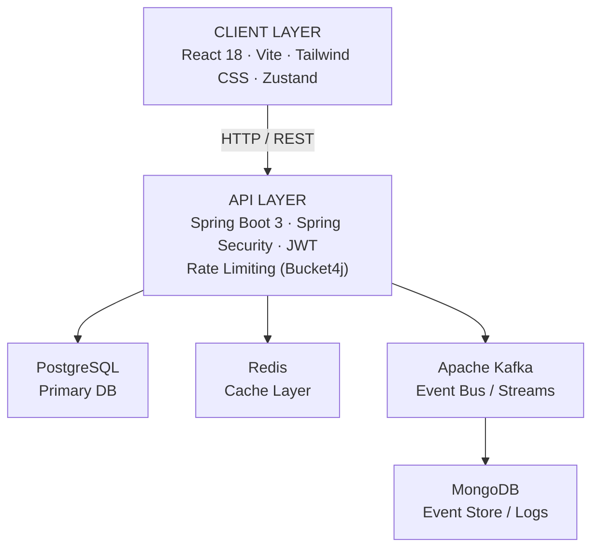

<p align="center">
  
</p>

<p align="center">
  
  
  
  
  
  
</p>

<p align="center">
  
  
  
</p>

---

## Overview

**mySHOP** is a high-performance, production-grade e-commerce platform built around event-driven architecture. It decouples core transactional workflows from downstream side-effects using Apache Kafka, implements a tiered Redis caching strategy for low-latency catalog reads, and enforces enterprise-grade security through stateless JWT authentication and role-based access control.

The entire platform is containerized and orchestrated via Docker Compose, enabling consistent, reproducible deployments from a single command.

---

## Architecture



---

## Technology Stack

<table>
<thead>
<tr>
<th>Tier</th>
<th>Technology</th>
<th>Purpose</th>
</tr>
</thead>
<tbody>
<tr>
<td><strong>Backend</strong></td>
<td>Java 21, Spring Boot 3, Spring Security</td>
<td>Core API and business logic</td>
</tr>
<tr>
<td><strong>Authentication</strong></td>
<td>JWT, RBAC</td>
<td>Stateless auth and role-based access control</td>
</tr>
<tr>
<td><strong>Primary Database</strong></td>
<td>PostgreSQL</td>
<td>Relational data persistence</td>
</tr>
<tr>
<td><strong>Cache</strong></td>
<td>Redis</td>
<td>High-speed catalog caching</td>
</tr>
<tr>
<td><strong>Event Store</strong></td>
<td>MongoDB</td>
<td>Telemetry and event log storage</td>
</tr>
<tr>
<td><strong>Messaging</strong></td>
<td>Apache Kafka</td>
<td>Async event streaming and service decoupling</td>
</tr>
<tr>
<td><strong>Rate Limiting</strong></td>
<td>Bucket4j</td>
<td>API traffic governance</td>
</tr>
<tr>
<td><strong>Frontend</strong></td>
<td>React 18, Vite, Tailwind CSS, Zustand</td>
<td>Reactive UI and client-side state management</td>
</tr>
<tr>
<td><strong>Ops</strong></td>
<td>Docker, Docker Compose</td>
<td>Containerization and orchestration</td>
</tr>
</tbody>
</table>

---

## Core Capabilities

**Asynchronous Event Processing** — Order lifecycle events (placement, cancellation, fulfillment) are published to Kafka topics and consumed by isolated downstream services. This decoupling ensures notification delivery and telemetry pipelines never block the primary transaction path.

**Tiered Caching Strategy** — High-traffic catalog endpoints are backed by Redis, reducing PostgreSQL load during peak periods. Cache eviction is automated and policy-driven, maintaining data consistency immediately following administrative updates.

**Traffic Governance** — Bucket4j-powered rate limiting protects all internal APIs from saturation and abuse. Synchronized frontend middleware manages the user experience gracefully during high-concurrency periods.

**Secure State Management** — Fully stateless JWT authentication eliminates session-state overhead. RBAC enforces strict access boundaries over product management, cache invalidation, and event stream monitoring.

---

## Getting Started

### Prerequisites

- [Docker](https://docs.docker.com/get-docker/) `v24+`
- [Docker Compose](https://docs.docker.com/compose/install/) `v2+`

### Installation

```bash
# Clone the repository
git clone https://github.com/medhxnsh/mySHOP.git

# Navigate into the project
cd mySHOP

# Build and start all services
docker-compose up -d --build
```

All services — backend, frontend, Kafka, Redis, PostgreSQL, and MongoDB — will be provisioned automatically.

---

## License

Distributed under the MIT License. See `LICENSE` for more information.

---

<p align="center">
  
</p>
